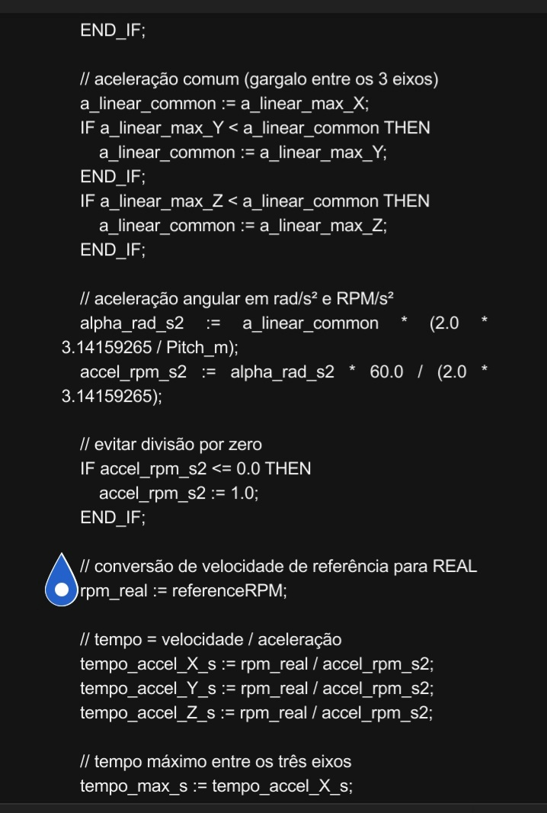

CONTROLADOR CNC RELEASE 9

Este trabalho é apresentado aos profissionais que concebem, desenvolvem e evoluem as tecnologias empregadas na automação industrial: arquitetos de software para CLPs, desenvolvedores de sistemas de Motion Control, projetistas de servoacionamentos, especialistas em tempo real, pesquisadores e engenheiros envolvidos na criação de plataformas de controle industrial.

A proposta consiste na apresentação de uma arquitetura de software desenvolvida integralmente em Texto Estruturado (IEC 61131-3), cuja organização separa as etapas de interpretação, processamento e preparação dos dados da execução determinística do controle de movimento. Nessa arquitetura, programas textuais são interpretados previamente, convertidos em estruturas de dados otimizadas e armazenados em buffers, permitindo que a camada responsável pela comunicação com os servoacionadores execute apenas operações compatíveis com os rigorosos requisitos temporais do sistema.

O trabalho integra conceitos de interpretação de linguagem, controle numérico computadorizado, gerenciamento de buffers, comunicação industrial, manipulação dos objetos do perfil CiA 402 e sincronização em redes EtherCAT, reunindo esses elementos em uma arquitetura única voltada à execução em controladores programáveis industriais.

Mais do que apresentar uma implementação, este trabalho propõe uma arquitetura passível de análise técnica. O convite é dirigido aos profissionais que constroem as tecnologias utilizadas pela indústria para que avaliem seus fundamentos, discutam suas decisões de projeto e examinem suas possibilidades de aplicação, evolução e integração com plataformas modernas de automação industrial.

Toda análise técnica, crítica fundamentada ou contribuição proveniente da experiência de profissionais envolvidos no desenvolvimento de sistemas industriais será considerada uma oportunidade para o aprimoramento desta arquitetura e para a ampliação do conhecimento na área de controle de movimento e automação industrial.

MOTIONCONTROL_Cia402_GRACIA_CODE

├── Controlador CNC em ST
│   ├── Interpretador GRACIA_CODE
│   ├── Motion Control
│   └── CiA 402 / EtherCAT

├── HMI Web
│   ├── HTML
│   ├── Node.js
│   └── WebSocket

├── FENIX
│   ├── Python
│   └── Tkinter

└── Documentação

flowchart TD
 # GRACIA-CODE CNC ARCHITECTURE

Arquitetura dividida em duas camadas principais:

- TASK LENTA:
  Interpretação, cálculo geométrico e preparação do movimento.

- TASK RÁPIDA:
  Execução determinística EtherCAT, controle dos drives e supervisão.

A geração de trajetória ocorre uma única vez e alimenta o buffer global.
A execução consome este buffer ponto a ponto sem reentrada na geração.

┌──────────────────────────────────────────────────────────────┐
│ [1] ENTRADA / HMI                                           │
│      (fora do tempo real)                                    │
├──────────────────────────────────────────────────────────────┤
│ HMI Python/Tkinter (Android)                                 │
│                                                              │
│ USB Serial (/dev/ttyGS0)                                    │
│ Protocolo texto: "nome=valor"                               │
│                                                              │
│ HMI_USB_Receiver_Transmitter                                │
│             ↓                                                │
│ ProcessarLinha                                              │
└──────────────────────────────────────────────────────────────┘
                           │
                           ▼

┌──────────────────────────────────────────────────────────────┐
│ [2] CARREGAMENTO DO PROGRAMA                                │
├──────────────────────────────────────────────────────────────┤
│ Loader_ProgGCODE                                             │
│             ↓                                                │
│ ProgramaGCODE[1..200]                                       │
│                                                              │
│ rxDone → dispara Interpretador                               │
└──────────────────────────────────────────────────────────────┘
                           │
                           ▼

┌──────────────────────────────────────────────────────────────┐
│ [3] INTERPRETAÇÃO                                           │
│      GRACIA_CODE → parâmetros                               │
├──────────────────────────────────────────────────────────────┤
│ Interpretador_GRACIA_CODE                                   │
│                                                              │
│ Blocos: "Função: Fx" ... "$"                                │
│                                                              │
│ Dicionário:                                                 │
│   Variaveis[]                                               │
│   TiposVariaveis[]                                          │
│                                                              │
│ Conversão:                                                  │
│   StrToReal                                                 │
│   StrToInt                                                  │
│   StrSplit                                                  │
│                                                              │
│ ExecuteFunc → F1 até F6                                     │
└──────────────────────────────────────────────────────────────┘
                           │
                           ▼

╔══════════════════════════════════════════════════════════════╗
║ [4] GERAÇÃO GEOMÉTRICA                                      ║
║      TASK LENTA                                              ║
║      não determinística                                      ║
╠══════════════════════════════════════════════════════════════╣
║ Funções:                                                     ║
║                                                              ║
║ F1 Linear / Circular                                         ║
║ F3 Bi-Planar                                                 ║
║ F4 Bi-Planar Pumpkin                                         ║
║ F5 Cônica                                                    ║
║ F6 Revolution Points                                         ║
║                                                              ║
║ Cada função calcula:                                         ║
║                                                              ║
║ • Geometria                                                 ║
║   (trigonometria e discretização angular)                   ║
║                                                              ║
║ • CalcAccelDecelFromProfile                                 ║
║   aceleração máxima real                                    ║
║   (Torque / Massa / Inércia)                                ║
║                                                              ║
║ • VELOCIDADE_X_Y_Z                                          ║
║                                                              ║
║ • ANG1                                                       ║
║   zona antecipada de frenagem (look-ahead)                  ║
║                                                              ║
║ • ConvertRealDiffToTargetDINT                               ║
║                                                              ║
║ Resultado gravado em:                                       ║
║                                                              ║
║ bufferX/Y/Z                                                 ║
║ bufferVelX/Y/Z                                              ║
║ bufferTarget_H/L                                            ║
║                                                              ║
║ Buffer único global sequencial.                             ║
║ Sem reentrada durante execução.                             ║
║                                                              ║
║ JOG possui buffer independente.                              ║
╚══════════════════════════════════════════════════════════════╝
                           │
                           ▼

══════════════ SINCRONIZAÇÃO ENTRE TASKS ══════════════

                           │
                           ▼

╔══════════════════════════════════════════════════════════════╗
║ [5] EXECUÇÃO DETERMINÍSTICA                                  ║
║      TASK RÁPIDA                                             ║
║      Ciclo EtherCAT: 1 ms                                    ║
╠══════════════════════════════════════════════════════════════╣
║ DRIVE_INPUT_OUTPUT                                           ║
║                                                              ║
║ Lê buffer calculado ponto a ponto.                           ║
║                                                              ║
║ Handshake CiA 402:                                           ║
║                                                              ║
║ 607Ah Target Position                                       ║
║          ↓                                                   ║
║ NEW_SETPOINT (6040h)                                        ║
║          ↓                                                   ║
║ ACKNOWLEDGE (6041h)                                         ║
║          ↓                                                   ║
║ Próximo ponto                                                ║
║                                                              ║
║ Sincronismo X/Y/Z:                                           ║
║ readyToAdvanceGlobal                                         ║
║                                                              ║
║ JOG_X_Y_Z_PULSADO                                           ║
║ ControlPushButtons                                           ║
║                                                              ║
║ Movimento manual paralelo                                    ║
║ bypassa o buffer automático.                                 ║
╚══════════════════════════════════════════════════════════════╝
                           │
                           ▼

╔══════════════════════════════════════════════════════════════╗
║ [6] MALHA DE COMPENSAÇÃO                                     ║
║      OBSERVAÇÃO / PESQUISA                                   ║
║      Não crítica para o drive                                ║
╠══════════════════════════════════════════════════════════════╣
║ LAG_6064_TORQUE_FORCA_VELOCIDADE                             ║
║                                                              ║
║ Compara:                                                     ║
║                                                              ║
║ posição real (6064h)                                         ║
║          ×                                                   ║
║ posição prevista no buffer                                   ║
║                                                              ║
║ Calcula:                                                     ║
║                                                              ║
║ • erro de seguimento (lag) por eixo                          ║
║ • ajuste de velocidade 6081h                                 ║
║ • Quick Stop em caso de correção insuficiente                ║
╚══════════════════════════════════════════════════════════════╝
                           │
                           ▼

┌──────────────────────────────────────────────────────────────┐
│ [7] SAÍDA / RETROALIMENTAÇÃO HMI                             │
├──────────────────────────────────────────────────────────────┤
│ Fluxo de monitoramento contínuo                              │
│                                                              │
│ PrepararLinhaTransmissao                                     │
│                                                              │
│ Envia para HMI:                                              │
│                                                              │
│ • posição atual                                              │
│ • lag dos eixos                                              │
│ • estados operacionais                                       │
│ • alarmes e falhas                                           │
│                                                              │
│ Este fluxo NÃO retorna para interpretação.                   │
│ Apenas atualiza supervisão e diagnóstico.                   │
└──────────────────────────────────────────────────────────────┘

