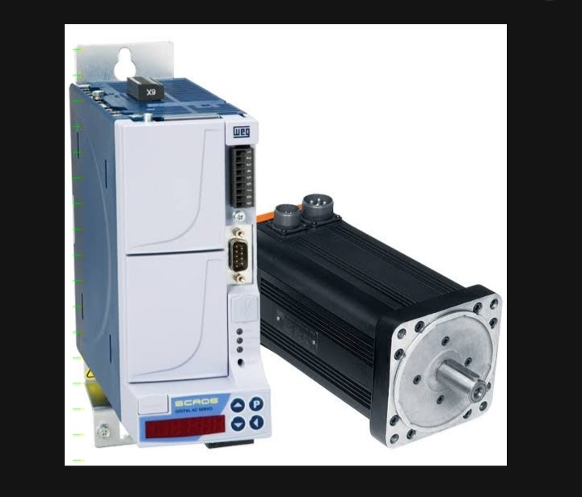
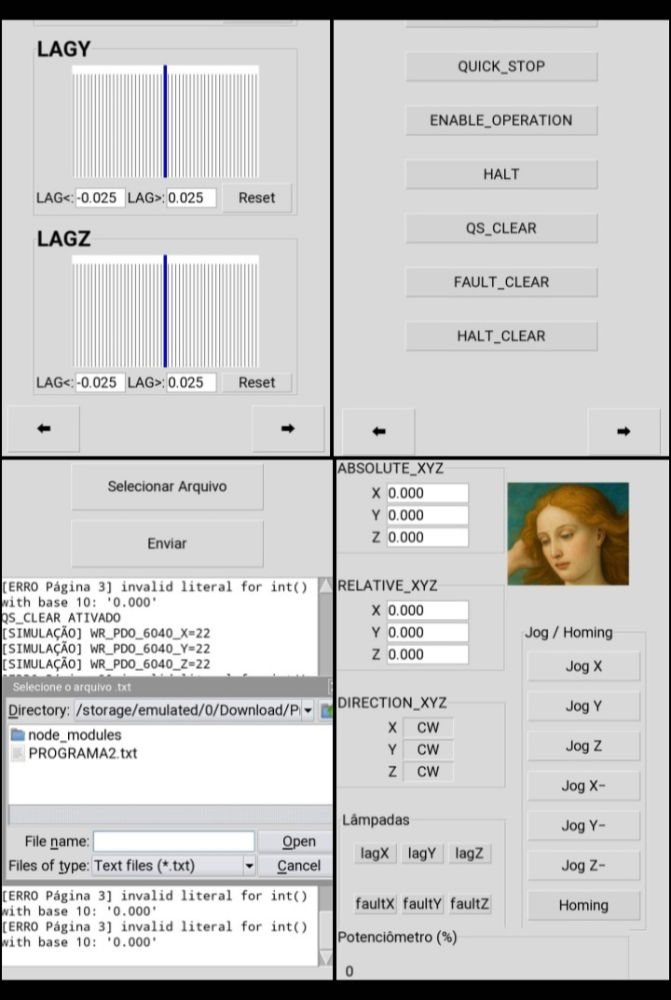
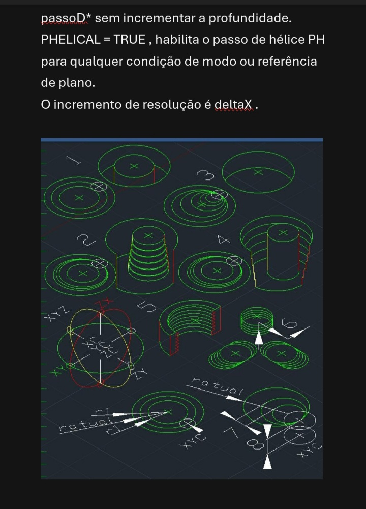
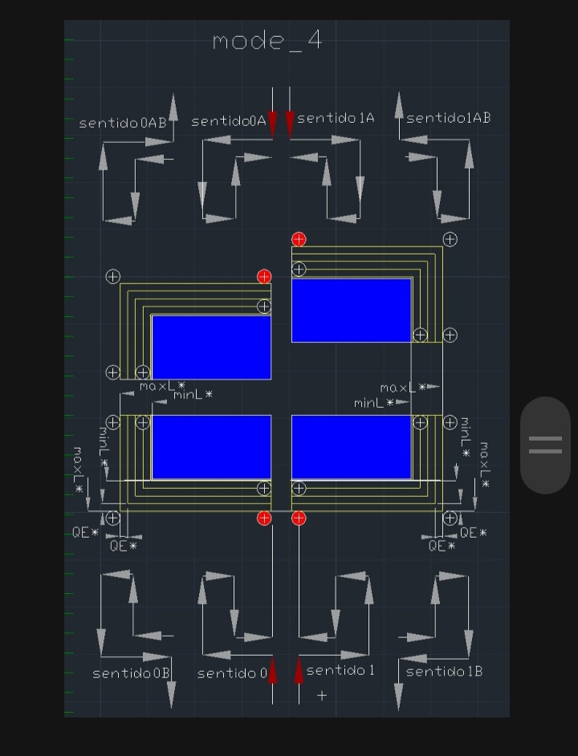
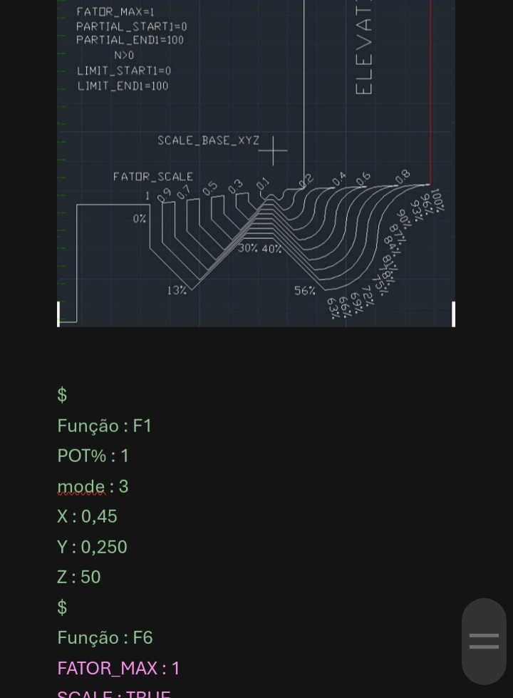
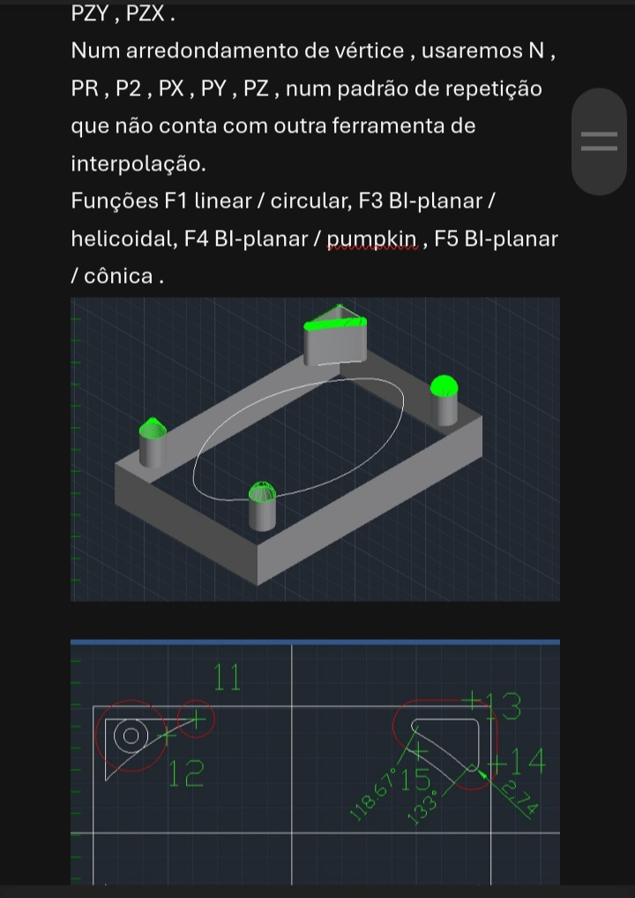
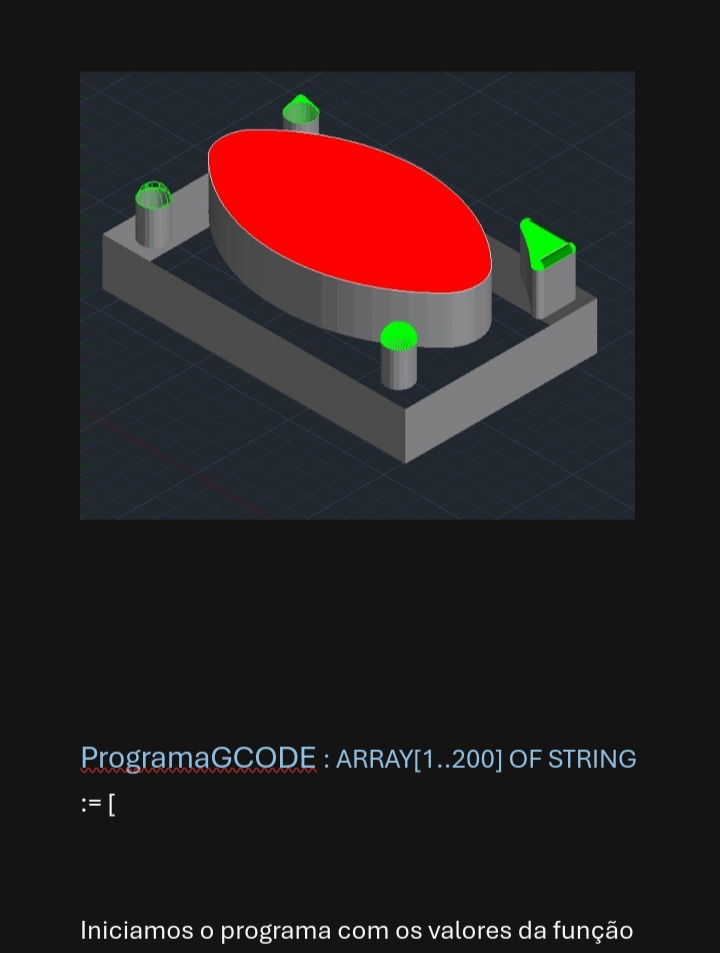

CONTROLADOR CNC RELEASE 9

Este trabalho é apresentado aos profissionais que concebem, desenvolvem e evoluem as tecnologias empregadas na automação industrial: arquitetos de software para CLPs, desenvolvedores de sistemas de Motion Control, projetistas de servoacionamentos, especialistas em tempo real, pesquisadores e engenheiros envolvidos na criação de plataformas de controle industrial.

A proposta consiste na apresentação de uma arquitetura de software desenvolvida integralmente em Texto Estruturado (IEC 61131-3), cuja organização separa as etapas de interpretação, processamento e preparação dos dados da execução determinística do controle de movimento. Nessa arquitetura, programas textuais são interpretados previamente, convertidos em estruturas de dados otimizadas e armazenados em buffers, permitindo que a camada responsável pela comunicação com os servoacionadores execute apenas operações compatíveis com os rigorosos requisitos temporais do sistema.

O trabalho integra conceitos de interpretação de linguagem, controle numérico computadorizado, gerenciamento de buffers, comunicação industrial, manipulação dos objetos do perfil CiA 402 e sincronização em redes EtherCAT, reunindo esses elementos em uma arquitetura única voltada à execução em controladores programáveis industriais.

Mais do que apresentar uma implementação, este trabalho propõe uma arquitetura passível de análise técnica. O convite é dirigido aos profissionais que constroem as tecnologias utilizadas pela indústria para que avaliem seus fundamentos, discutam suas decisões de projeto e examinem suas possibilidades de aplicação, evolução e integração com plataformas modernas de automação industrial.

Toda análise técnica, crítica fundamentada ou contribuição proveniente da experiência de profissionais envolvidos no desenvolvimento de sistemas industriais será considerada uma oportunidade para o aprimoramento desta arquitetura e para a ampliação do conhecimento na área de controle de movimento e automação industrial.

MOTIONCONTROL_Cia402_GRACIA_CODE

├── Controlador CNC em ST
│   ├── Interpretador GRACIA_CODE
│   ├── Motion Control
│   └── CiA 402 / EtherCAT

├── HMI Web
│   ├── HTML
│   ├── Node.js
│   └── WebSocket

├── FENIX
│   ├── Python
│   └── Tkinter

└── Documentação

